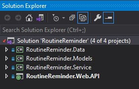
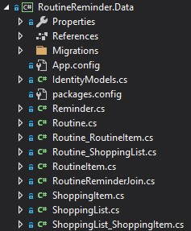
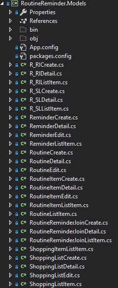
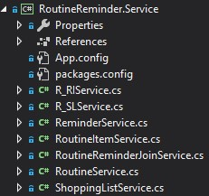
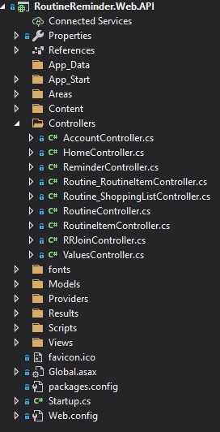

# Routine Reminder 
#### A new tool developed for the forgetful

---

## Description
Routine Reminder was created to help remember and keep track of all the routines in your life. This tool can be used in everyone's life, whether you are a busy parent with kids on a nighttime routine or a student wanting to have a calmer morning.

## Technologies used
*  Visual Studio 2019 Community
*  C#
*  Git Hub
*  Trello [(VISIT)](https://trello.com/b/pXmOUogx/routine-reminder)
*  dbdiagram.io

# Routine Reminder API: Group Project

In this project our team collaborated using Git to create a C# .NET Framework Application to function as a daily reminder and organizer system for individuals with busy schedules. Our Web API utilized an n-tier structure with Data, Models, Services, and Web API tiers. We then used PostMan to test the functionality of our Endpoints.

# Routine Reminder Project Layout

#### This project in a N-teir solution that has multiple layers

## Data: 

#### This layer houses our classes that relate to the Data Base

## Models:

#### This layer houses our reusable models for the rest of the layers

## Services:

#### This contains most of the working code that allows us to perform our CRUD functions

## Web API:

#### This is where the controllers and API endpoints are

## Installation

Click on the green code button    at the top right and select clone or download the zip file.   
It is easiest to use Visual Studio 2019 Community.  Download VS free [HERE](https://visualstudio.microsoft.com/downloads/) 

## Contributing
To contribute to this project, follow the instructions for cloning, then commit your code or changes on a new branch.  Please be sure to include unit test before making a pull request.

## Creators
This project was designed and developed by James Campbell, Jakob Amstutz, Taylor Fulner.

